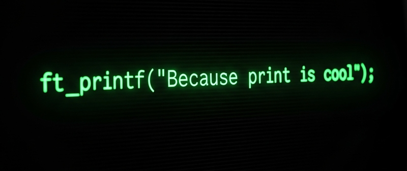

  

# ft_printf #️⃣

**ft_printf** is a custom implementation of the standard C `printf` function, developed for educational purposes. This project demonstrates advanced C programming techniques, including handling variadic functions, string manipulation, and memory management.

## Overview 📝

This project aims to recreate the behavior of `printf`, supporting a subset of its format specifiers. It is intended as a learning tool to understand how formatted output works under the hood in C.

## Supported Format Specifiers

- `%c` : Character
- `%s` : String
- `%p` : Pointer address
- `%d` / `%i` : Signed decimal integer
- `%u` : Unsigned decimal integer
- `%x` / `%X` : Unsigned hexadecimal integer (lowercase/uppercase)
- `%%` : A literal `%` character

## Building 🔧

To compile the library, use the provided Makefile:

```bash
make
```

This will create the static library `libftprintf.a`.

## Usage 🔍

Include the header in your C source file:

```c
#include "ft_printf.h"
```

Compile your program with the library:

```bash
gcc your_program.c -L. -lftprintf
```

Example usage in code: 🔌

```c
ft_printf("Hello, %s! Number: %d\n", "world", 42);
```

## Project Structure 💾

- `ft_printf.c`, `ft_printf.h`: Core implementation and header
- Additional `.c` files: Helper functions and format handling
- `Makefile`: Build instructions


## Author ☕

Developed by [spaderale](https://github.com/spaderale).
